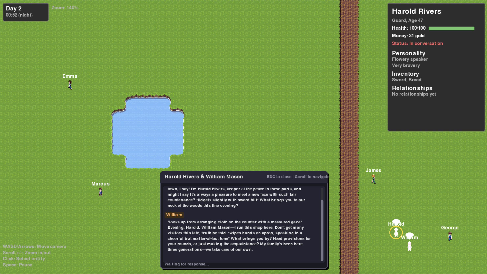

# LLMville

A social simulation game with LLM-driven NPCs that converse, persist memory, and take actions in an open ended environment.



## What is this?

LLMville is a 2D town simulation where characters:
- Have dynamic conversations generated by LLMs
- Take **open-ended actions** interpreted by AI (no scripted behaviors)
- Form relationships based on their interactions
- Remember past encounters and carry persistent injuries/conditions

Each NPC has a unique personality (friendliness, honesty, greed, etc.) that influences how they talk and behave. Characters can attempt *any* action naturally in dialogue—punch someone, give a gift, steal an item—and an AI orchestrator determines what happens. Relationships and physical state evolve based on these interactions.

## Features

- **AI Conversations**: NPCs chat using LLMs, with dialogue influenced by their personality and past experiences
- **Open-Ended Actions**: Characters can attempt any action naturally—the AI interprets dialogue and resolves outcomes
- **Persistent State**: Injuries like "broken leg" or "black eye" persist, affect movement, and appear in future conversations
- **Relationship System**: Characters form opinions and remember interactions
- **Procedural World**: 50x50 grid with roads, buildings, water, and terrain
- **Day/Night Cycle**: Time passes, affecting NPC schedules

## Quick Start

```bash
# Install dependencies
pip install -r requirements.txt

# (Optional) Add your Claude API key for real AI conversations
cp .env.example .env
# Edit .env and add: ANTHROPIC_API_KEY=sk-ant-...

# Run the game
python main.py
```

## Controls

| Input | Action |
|-------|--------|
| **WASD / Arrows** | Pan camera |
| **+ / -** | Zoom in/out |
| **Scroll** | Zoom or scroll dialogue |
| **Click** | Select NPC |
| **Tab** | Character details |
| **Space** | Pause/Resume |
| **Esc** | Close panel / Quit |

## How It Works

1. NPCs spawn with random names, personalities, and roles (Shopkeeper, Guard, Farmer, etc.)
2. They pathfind around town using A* algorithm
3. When two NPCs get close, they might start a conversation
4. Claude generates dialogue based on their personalities and relationship history
5. After each message, an AI interpreter checks for meaningful actions (not mundane gestures)
6. If detected, an AI resolver determines success/failure and applies real state changes
7. Conditions persist and affect future behavior (e.g., "broken leg" slows movement)
8. After chatting, their relationship updates based on how things went

## Project Structure

```
llmville/
├── main.py              # Entry point
├── config.py            # Game settings
├── src/
│   ├── core/            # Game loop, world, time
│   ├── entities/        # Person (with CharacterState), items, entity manager
│   ├── systems/         # Movement, relationships, health, state_manager
│   ├── ai/              # Claude integration, prompts, action interpreter, outcome resolver
│   ├── interaction/     # Dialogue manager
│   ├── rendering/       # Pygame rendering
│   └── ui/              # HUD, panels
└── assets/              # Sprites and tiles
```

## Tech Stack

- **Python 3.10+**
- **Pygame** - 2D rendering
- **Anthropic API** - Claude for NPC dialogue
- **python-dotenv** - Environment config

## Configuration

Key settings in `config.py`:
- Window: 1600x900 @ 60 FPS
- Grid: 50x50 tiles
- Time: 1 real second = 1 game minute
- AI Model: Claude Haiku

## License

MIT
